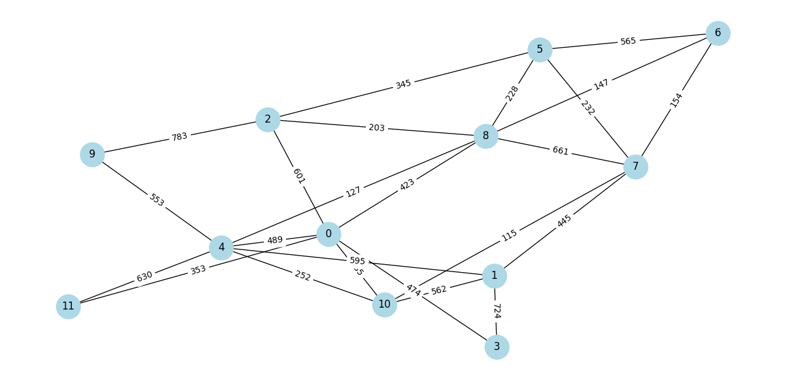

# telecom-network-analysis
Graph-based analysis of telecom networks including routing, centrality, and resilience (synthetic model)

## Methodology

- The network is modeled as a weighted undirected graph using NetworkX
- Link weights represent physical distances (km)
- Routing is computed using shortest path algorithms
- OLA (Optical Line Amplifier) requirements are estimated per link:
  - Span length = 80 km
  - Number of OLA = ceil(distance / 80) - 1
- Energy consumption is calculated assuming 12W per OLA

## Example Output

The figure below illustrates a synthetic telecom network topology with weighted links representing physical distances between nodes.

## Insights

- Longer routes require significantly more OLA units, increasing energy consumption
- Network topology strongly affects routing efficiency
- Optimization of link distances can reduce amplification requirements

## Research Relevance

This project simulates an optical backbone network to analyze routing efficiency and energy consumption under physical-layer constraints.

The model can be extended to study energy-efficient routing strategies and infrastructure optimization in large-scale telecom networks.

The model assumes static traffic and does not include dynamic routing adaptation
